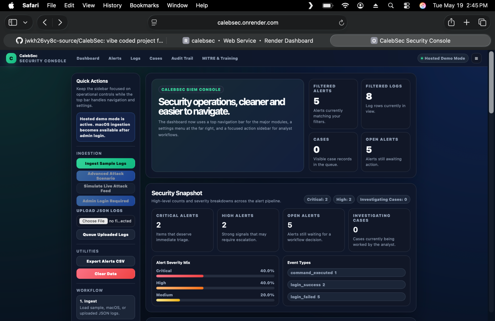
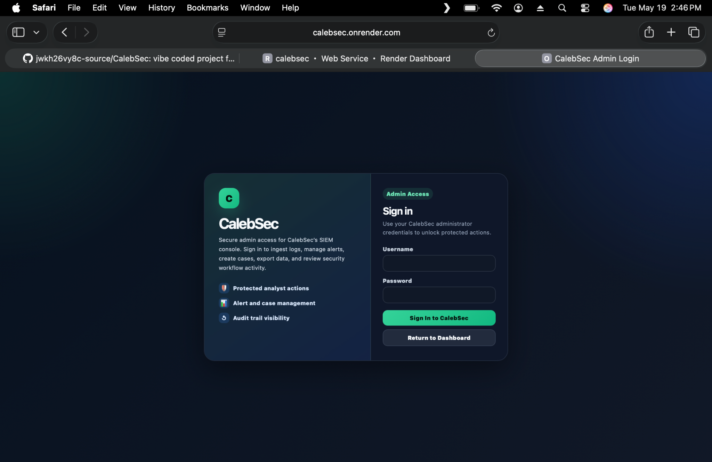
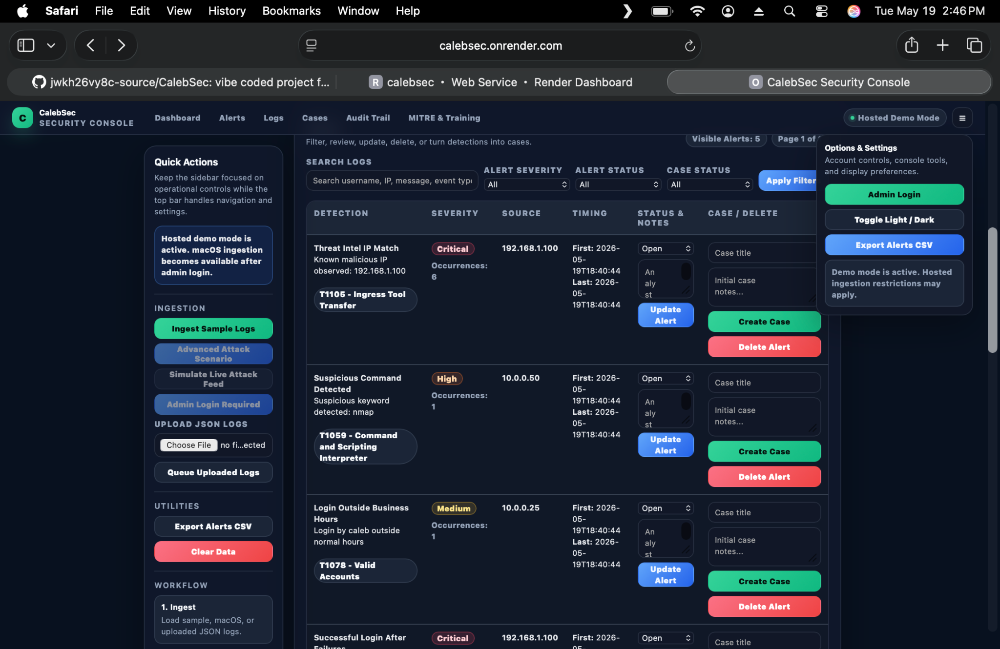
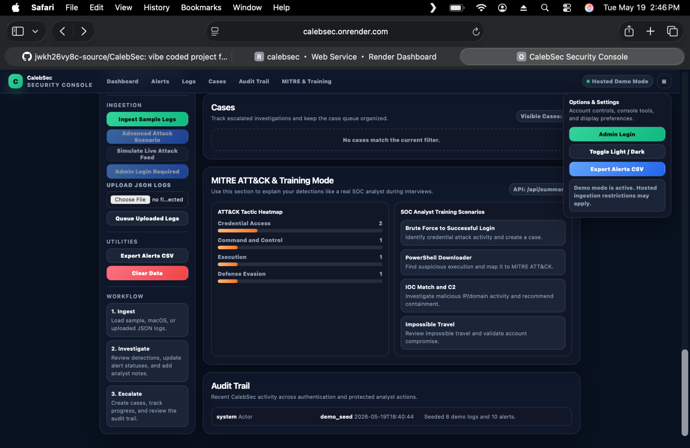

# CalebSec SIEM Console

A deployable blue-team security monitoring project built with **FastAPI**, **SQLite**, and a custom detection pipeline. CalebSec simulates a lightweight Security Information and Event Management workflow by ingesting logs, generating alerts, supporting investigations, and presenting activity through a polished analyst dashboard.

> **Live Demo:** [https://calebsec.onrender.com](https://calebsec.onrender.com)
> **Repository:** [https://github.com/jwkh26vy8c-source/CalebSec/tree/main](https://github.com/jwkh26vy8c-source/CalebSec/tree/main)

---

## Project Overview

CalebSec was created as a practical cybersecurity portfolio project to strengthen hands-on experience with:

* Security event ingestion
* Detection engineering fundamentals
* Alert triage and severity handling
* MITRE ATT&CK mapping
* Analyst case management
* Audit logging and administrative controls
* Secure web application design concepts

The project is designed to resemble the workflow of a junior SOC analyst reviewing security telemetry, investigating alerts, and tracking incidents from detection to closure.

---

## Key Features

### Security Monitoring & Detection

* JSON log ingestion and sample log seeding
* macOS log collection support for local analyst testing
* Detection rules for:

  * Multiple failed login attempts
  * Successful login after repeated failures
  * Logins outside normal business hours
  * Suspicious command keywords such as `nmap`, `mimikatz`, `sudo`, `chmod 777`, and `whoami`
* Severity labels including Medium, High, and Critical
* MITRE ATT&CK technique references for generated alerts

### Analyst Workflow

* Alert dashboard with searchable logs and filtered alerts
* Alert status updates and analyst notes
* Case creation and case tracking
* Audit event history for administrative and workflow actions
* CSV alert export for reporting or offline review
* Alert occurrence tracking with first-seen and last-seen timestamps

### Application Security & Admin Controls

* Admin login flow
* Session-based authentication
* CSRF token helpers for protected form actions
* Rate limiting for sensitive actions
* Custom error handling pages
* Hosted demo mode support through environment variables

### UI & Usability

* Modern analyst-console dashboard design
* Dark/light mode toggle interface
* Responsive layout for desktop and smaller screens
* Separate sections for dashboard metrics, logs, alerts, cases, and audit history

---

## Tech Stack

* **Backend:** Python, FastAPI
* **Frontend:** Jinja2 templates, HTML, CSS
* **Database:** SQLite
* **Deployment:** Render
* **Server:** Uvicorn

---

## Screenshots

### Dashboard Overview



### Admin Login



### Alert Investigation View



### MITRE ATT&CK & Training Mode



---

## Example Detection Scenario

A sample brute-force chain can be represented as:

1. Multiple failed login attempts occur from the same source IP.
2. CalebSec raises a **High** severity brute-force alert.
3. A successful login from that same source after failures triggers a **Critical** alert.
4. The analyst can review the alert, add notes, and create a case for further investigation.

This workflow models how repeated authentication failures and a subsequent success can indicate credential compromise attempts.

---

## Local Setup

### 1. Clone the Repository

```bash
git clone https://github.com/jwkh26vy8c-source/CalebSec.git
cd CalebSec
```

### 2. Create and Activate a Virtual Environment

```bash
python3 -m venv .venv
source .venv/bin/activate
```

### 3. Install Dependencies

```bash
pip install -r requirements.txt
```

### 4. Configure Environment Variables

Create a `.env` file or define environment variables in your terminal/deployment platform.

Example values:

```env
ADMIN_USERNAME=caleb
ADMIN_PASSWORD=change-this-password
SESSION_SECRET=change-this-session-secret
SESSION_COOKIE_SECURE=false
DEMO_MODE=false
ENABLE_MACOS_INGEST=true
```

### 5. Start the Application

```bash
uvicorn main:app --reload
```

Open the local app in your browser at:

```text
http://127.0.0.1:8000
```

---

## Render Deployment Notes

This project can be deployed on Render using a start command similar to:

```bash
uvicorn main:app --host 0.0.0.0 --port $PORT
```

When the project lives inside a subfolder in GitHub, configure Render’s **Root Directory** to the folder that contains `main.py`, `requirements.txt`, and your templates.

---

## Recommended GitHub Repository Structure

```text
calebsec-siem/
├── main.py
├── database.py
├── detection.py
├── macos_ingest.py
├── requirements.txt
├── render.yaml
├── templates/
│   ├── dashboard.html
│   ├── login.html
│   └── error.html
├── sample_logs/
│   └── auth_logs.json
├── screenshots/
│   ├── dashboard.png
│   ├── alerts.png
│   └── login.png
└── README.md
```

---

## Cybersecurity Skills Demonstrated

This project demonstrates practical familiarity with:

* SIEM-style security monitoring concepts
* Log ingestion and normalization workflows
* Authentication-focused detection logic
* MITRE ATT&CK awareness
* Alert severity and triage concepts
* Incident case management fundamentals
* Auditability and admin action tracking
* Secure web application controls such as CSRF protection and rate limiting

---

## Future Improvements

Planned enhancements could include:

* Additional detection rules for PowerShell abuse, privilege escalation, and impossible travel
* IOC enrichment for malicious IPs, domains, or hashes
* Live event streaming or real-time alert updates
* Expanded MITRE ATT&CK visualizations
* Role-based access control beyond admin-only sessions
* Docker support and CI/CD checks
* Analyst training mode with guided SOC scenarios

---

## Resume-Friendly Project Summary

> Built and deployed a FastAPI-based SIEM-style security console featuring log ingestion, custom authentication detections, MITRE ATT&CK-mapped alerts, analyst case management, audit trail logging, CSV reporting, and secure admin controls using session authentication, CSRF protection, and rate limiting.

---

## Author

**Caleb DeBari**
Cybersecurity-focused builder developing practical blue-team and SOC analyst portfolio projects.
